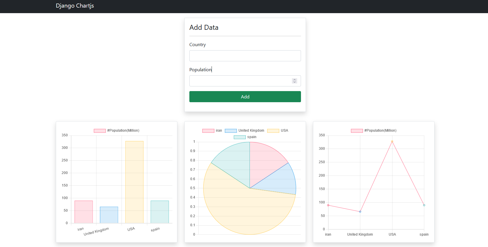

# django-chartjs
integrating django and chartjs using channels package

=======================================================



## Setup The project
1. Clone the repository: 
```bash
git clone https://github.com/sinasezza/django-chartjs.git
cd django-chartjs
```

2. create  a virtual environment & activate it(Optional):

__macOs/Linux Users__
```bash
python3 -m venv venv
source ./venv/bin/activate
```

__Windows Users__
```bash
python -m venv venv
venv\Scripts\activate
```

3. Install dependencies:  
```bash 
pip install pip-tools
pip-sync requirements.txt
```

4. make migrations
```bash 
python manage.py makemigrations
python manage.py migrate
```

5. run the http server
```bash
python manage.py runserver
```